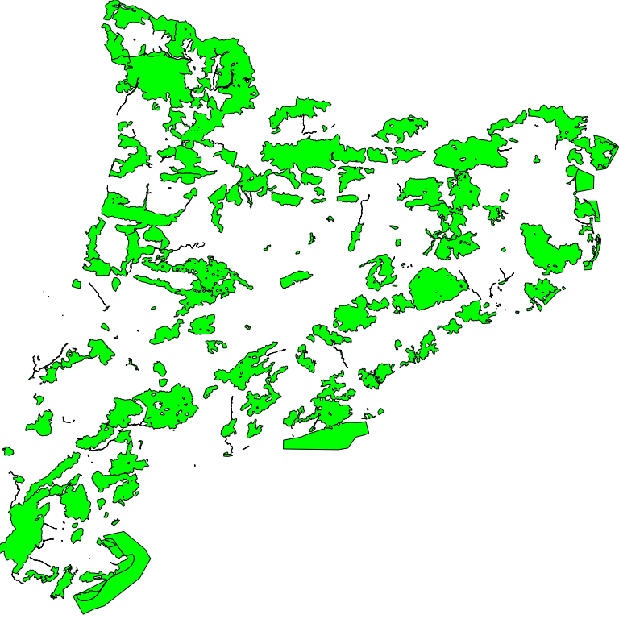

**************************************
MapServer - Mapfile carga de shapefile
**************************************

.. note::

	=================  ====================================================
	Fecha              Autores
	=================  ====================================================
	14 Febrero 2017    * Wladimir Szczerban
	=================  ====================================================

	©2017 Wladimir Szczerban

	Excepto donde quede reflejado de otra manera, la presente documentación se halla bajo licencia: Creative Commons (Creative Commons - Attribution - Share Alike: http://creativecommons.org/licenses/by-sa/3.0/deed.es)

MapServer - Mapfile carga de shapefile
======================================

Configuración de un archivo Mapfile (.map) para cargar una capa en formato ESRI shapefile (.shp).

.. warning:: Los todos los datos utilizados en este ejemplo son datos de ejemplo y no tienen ningún carácter oficial. Igualmente los datos pueden proceder de fuentes diferentes a las indicadas en la configuración del servicio y ser datos no reales.

#. Crear la carpeta del proyecto *(mtig2017)* donde crearemos y copiaremos todos los archivos. Es recomendable que la carpeta no esté en una ruta accesible desde Internet para evitar que los usuarios accedan directamente a nuestros datos. ::

    Por ejemplo: crear la carpeta en C:\Users\XXXX\mtig2017

#. Crear el archivo *pein.map* dentro de la carpeta del proyecto. Abrir el archivo con un editor de texto (Notepad++, Atom, Sublime, etc).

#. Crear el objeto MAP. ::

    # Inicio arxivo MAP
    MAP

    #Nombre de la aplicación no debe contener espacios ni carácteres especiales
    NAME plan_pein

    #Estado
    STATUS ON

    #Extensión mapa [minx] [miny] [maxx] [maxy]
    EXTENT 263747.60 4484436.53  527495.20 4748184.13

    #Unidades del mapa
    UNITS METERS

    #Tamaño máximo de la imagen
    MAXSIZE 4096

    #Ruta de la cartografia
    SHAPEPATH "datos"

    #Color de fondo
    IMAGECOLOR 255 255 255

    #Formato de salida de la imagen
    OUTPUTFORMAT
      NAME "png8"
      DRIVER AGG/PNG8
      MIMETYPE "image/png"
      IMAGEMODE RGBA
      EXTENSION "png"
      FORMATOPTION "QUANTIZE_FORCE=on"
      FORMATOPTION "QUANTIZE_COLORS=256"
      FORMATOPTION "GAMMA=0.75"
    END

    #Ruta librería proyecciones
    CONFIG "PROJ_LIB" 'C:/ms4w/proj/nad/'

    #Proyección por defecto del mapa
    PROJECTION
    "init=epsg:25831"
    END

    #Definició de las capacidades
    WEB
     IMAGEPATH "tmp/"
     IMAGEURL "tmp/"
     METADATA
        OWS_TITLE "Aplicación OGC"
        OWS_ABSTRACT "Ejemplo de interoperabilidad utilitzando Minnesota MapServer"
        OWS_ENABLE_REQUEST "*"
        OWS_ONLINERESOURCE "http://localhost:81/cgi-bin/mapserv.exe?map=C:/Users/XXXX/mtig2017/pein.map"
        OWS_SRS "EPSG:23031 EPSG:4326 EPSG:25831 EPSG:4258 EPSG:4230 EPSG:3857 EPSG:32631"
        OWS_EXTENT "263747.60 4484436.53 527495.20 4748184.13"
        WMS_FEATURE_INFO_MIME_TYPE "text/html"
        OWS_ACCESSCONSTRAINTS "NINGUNO"
        OWS_LIMITSCONSTRAINTS "NINGUNO"
        OWS_FEES "NINGUNO"
        OWS_ADDRESSTYPE "MAILING ADDRESS"
        OWS_CITY "Barcelona"
        OWS_STATEORPROVINCE "Barcelona"
        OWS_CONTACTELECTRONICMAILADDRESS "test@icgc.cat"
        OWS_CONTACTPERSON ""
        OWS_CONTACTORGANIZATION "Institut Cartogràfic i Geològic de Catalunya"
        OWS_ADDRESS "Parc de Montjuic sn"
        OWS_POSTCODE "08038"
        OWS_COUNTRY "Spain"
        OWS_CONTACTPOSITION "Geostarters"
        OWS_CONTACTVOICETELEPHONE ""
        OWS_SERVICE_ONLINERESOURCE "http://catalegidec.icc.cat"
        OWS_ROLE "Provaider"
        OWS_KEYWORDLIST "Cataluña,servicio,mapa,pein"
        OWS_CONTACTFACSIMILETELEPHONE ""
        OWS_HOURSOFSERVICE ""
        OWS_CONTACTINSTRUCTIONS ""
        OWS_ATTRIBUTION_ONLINERESOURCE "http://www.icgc.cat"
        OWS_ATTRIBUTION_TITLE "ICGC"
        OWS_BBOX_EXTENDED "True"
        OWS_HTTP_MAX_AGE "3600"
        LABELCACHE_MAP_EDGE_BUFFER "10"
        OWS_SLD_ENABLED "true"
      END
    END

    #definicion de la leyenda del mapa

    #definicion de las capas del mapa

    #Final arxiu MAP
    END

#. Comprobar que no tenemos ningún error en el Mapfile. Abrir el navegador y escribir: ::

		http://localhost:81/cgi-bin/mapserv.exe?map=C:/Users/XXXX/mtig2017/pein.map

#. Comprobar que retorna el siguente mensaje: ::

		mapserv(): Web application error. Traditional BROWSE mode requires a TEMPLATE in the WEB section, but none was provided.

#. Definir la capa del mapa.

    #. Crear la carperta *datos* dentro del directorio del proyecto

    #. Descargar el archivo :download:`pein_etrs89.zip <pein_etrs89.zip>`

    #. Descomprimir el archivo pein_etrs89.zip dentro de la carpeta *datos*

    #. Escribir la definicioń de la capa en el Mapfile. Justo debajo de donde dice *#definicion de las capas del mapa* agregamos lo siguiente. ::

        #Definición de la capa pein
        LAYER
          NAME pein
          TYPE POLYGON
          STATUS ON
          DATA "pein_etrs89"
          TEMPLATE "info.html"
          CLASSITEM 'AMBIT'
          CLASS
        	NAME 'pein'
            STYLE
        	  OUTLINECOLOR 10 10 10
        	  COLOR 0 255 0
        	  WIDTH 1
        	END
          END
          PROJECTION
        	"init=epsg:25831"
          END
          #Permite exportar GML
          DUMP TRUE
          #Descripció de la capa
          METADATA
        	  OWS_TITLE "Plan Espacios de Interés Natural"
            OWS_ABSTRACT "metadatos"
            OWS_SRS "EPSG:23031 EPSG:4326 EPSG:25831 EPSG:4258 EPSG:4230 EPSG:3857 EPSG:32631"
        	  GML_INCLUDE_ITEMS "all"
          END
        END

#. Verificar que funcione el getCapabilities. Abrir el navegador y escribir:

	::

		http://localhost:81/cgi-bin/mapserv.exe?map=C:/Users/XXXX/mtig2017/pein.map&request=getCapabilities&service=wms

	.. note::

		Debemos ver el archivo xml con la descripción de las capacidades del servidor.

#. Hacer la petión getMap para visualizar el mapa. Abrir el navegador y escribir: ::

  	http://localhost:81/cgi-bin/mapserv.exe?map=C:/Users/XXXX/mtig2017/pein.map&REQUEST=GetMap&SERVICE=WMS&VERSION=1.1.1&LAYERS=pein&FORMAT=image/png&STYLES=&SRS=EPSG:25831&BBOX=263747.60,4484436.53,527495.20,4748184.13&WIDTH=768&HEIGHT=768

#. Debemos ver como respuesta nuestro mapa

+--------+
| |logo| |
+--------+

#. En la carpeta del proyecto creamos el archivo *info.html* que es el encargado de mostrar la información de los elementos seleccionados al hacer una petición getFeatureInfo.::

		<!-- MapServer Template -->
		<html>
		<head>
		<title>Pein</title>
		<meta http-equiv="Content-Type" content="text/html; charset=utf-8">
		</head>
		<body>
		<h3>[cl]</h3>
		<table cellspacing="0" cellpadding="0">
		<tbody>
		<tr>
		<th>Nombre</th><td>[NOM]</td>
		</tr>
		<tr>
		<th>Código</th><td>[CODI]</td>
		</tr>
		<tr>
		<th>Delimitación</th><td>[DELIMITACI]</td>
		</tr>
		<tr>
		<th>Ámbito</th><td>[AMBIT]</td>
		</tr>
		</tbody>
		</table>
		</body>
		</html>

#. Comprobar que al interrogar a nuestro mapa nos retorna la información correcta.::

		http://localhost:81/cgi-bin/mapserv.exe?map=C:/Users/XXXX/mtig2017/pein.map&REQUEST=GetFeatureInfo&SERVICE=WMS&VERSION=1.1.1&LAYERS=pein&QUERY_LAYERS=pein&INFO_FORMAT=text/html&STYLES=&SRS=EPSG:25831&BBOX=263747.60,4484436.53,527495.20,4748184.13&WIDTH=768&HEIGHT=768&X=418&Y=509
