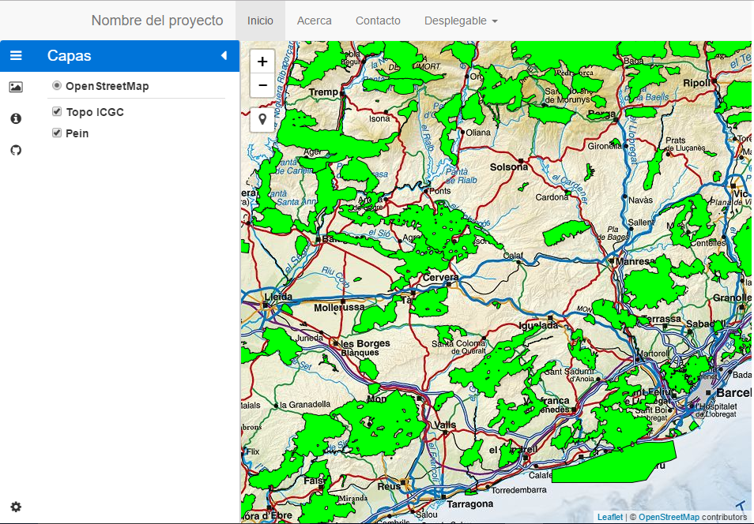

****************************************
Bootstrap - Mapa Leaflet - Control capas
****************************************

.. note::

	=================  ====================================================
	Fecha              Autores
	=================  ====================================================
	14 Febrero 2017    * Wladimir Szczerban
	=================  ====================================================

	©2017 Wladimir Szczerban

	Excepto donde quede reflejado de otra manera, la presente documentación se halla bajo licencia: Creative Commons (Creative Commons - Attribution - Share Alike: http://creativecommons.org/licenses/by-sa/3.0/deed.es)

Bootstrap - Mapa Leaflet - Control capas
========================================

Añadiremos a nuestro mapa un control de capas que permita a los usuarios cambiar entre distintas capas de base y activar/desactivar las superposiciones. Para ellos utilizaremos el *Control.Layers* [#]_ de Leaflet.

Hay dos tipos de capas: (1) capas base que son mutuamente excluyentes (sólo una puede ser visible a la vez en el mapa), p. Capas de teselas y (2) superposiciones, que son todas las otras cosas que se ponen sobre las capas de base.

Ejemplo de uso. ::

		var baseLayers = {
		    "Mapbox": mapbox,
		    "OpenStreetMap": osm
		};
		var overlays = {
		    "Marker": marker,
		    "Roads": roadsLayer
		};
		L.control.layers(baseLayers, overlays).addTo(map);

A continuación, crearemos dos objetos en el apartado de javascript. Uno contendrá nuestras capas de base y uno contendrá nuestras superposiciones. Estos son simples objetos con pares clave/valor. La clave establece el texto para la capa en el control (por ejemplo, "Base ortofoto"), mientras que el valor correspondiente es una referencia a la capa (por ejemplo: wmsOrto).

#. Crear el objeto que contendrá las capas base. En nuestro mapa tenemos la capa del servidor de teselas de OpenStreetMap. Esta capa la utilizaremos como capa base. Para ello escribiremos lo siguiente despues de la declaración de nuestras capas: ::
   
   	var baseMaps = {
			"OpenStreetMap": osm
		};

#. Crear el objeto que contendrá las superposiciones de capas. En nuestro mapa tenemos las 2 capas WMS que utilizaremos como superposiciones. Para ello escribiremos lo siguiente justo debajo de donde declaramos el objeto *baseMaps*: ::
   
   	var overlayMaps = {
			"Topo ICGC": icgc,
			"Pein": wmsPein
		};

#. Agregar el control al mapa. Debajo de la declaración de los dos objetos que contienen las capas debemos escribrir lo siguiente: ::
   
   	var controlCapas = L.control.layers(baseMaps, overlayMaps).addTo(map);

#. Abrir el navegador y ver que nos aparece un nuevo control en el mapa. ::

		http://localhost:81/visor/movil.html

#. Agregar el control de capas a la barra lateral. Para ellos escribir lo siguiente justo despues de donde agregamos el control al mapa. ::
   
   	document.getElementById("control-capas").appendChild(
    	controlCapas.getContainer()
	);

#. Modificar el estilo del control de capas. Al final del apartado de estilo de la página escribiri lo siguiente: :: 
   
   	.leaflet-control-layers{
		width: 100%;
	}

	.leaflet-touch .leaflet-control-layers{
		border: 0px;
	}

#. Abrir el navegador y ver que nos aparece el control de capas en el menú lateral. ::

	http://localhost:81/visor/movil.html

+----------------------+
| |logo_control_capas| |
+----------------------+

.. [#] http://leafletjs.com/reference-1.0.3.html#control-layers