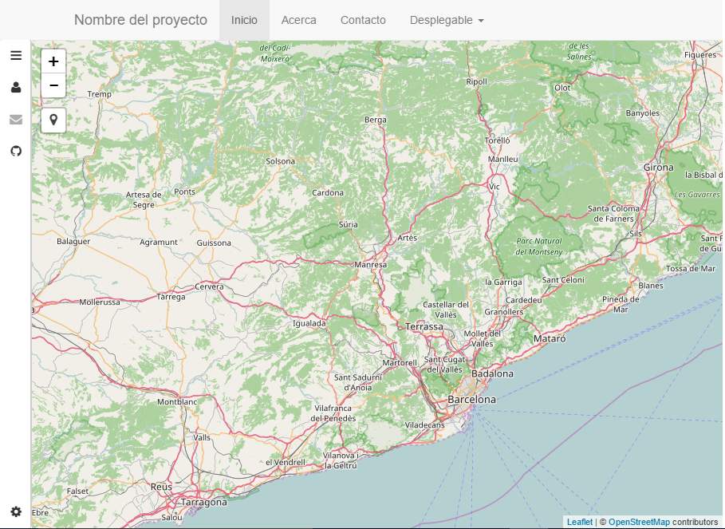

***************************************
Bootstrap - Mapa Leaflet - Menú lateral
***************************************

.. note::

	=================  ====================================================
	Fecha              Autores
	=================  ====================================================
	14 Febrero 2017    * Wladimir Szczerban
	=================  ====================================================

	©2017 Wladimir Szczerban

	Excepto donde quede reflejado de otra manera, la presente documentación se halla bajo licencia: Creative Commons (Creative Commons - Attribution - Share Alike: http://creativecommons.org/licenses/by-sa/3.0/deed.es)

Bootstrap - Mapa Leaflet - Menú lateral
=======================================

Añadiremos a nuestro mapa un control que permite la creación de un menú lateral donde podremos poner información, para ello utilizaremos el plugin *Sidebar-v2* [#]_.

#. Ir a la página Web de Sidebar-v2 y en el apartado de releases descargar la última versión https://github.com/Turbo87/sidebar-v2/releases
   
#. En la carpeta visor donde tenemos nuestro html debemos crear 2 carpetas; una llamada *css* y la otra *js*. 
   
#. Dentro de la carpeta css copiaremos el archivo *leaflet-sidebar.min.css* que se encuentra dentro del archivo descargado.

#. Dentro de la carpeta js copiaremos el archivo *leaflet-sidebar.min.js* que se encuentra dentro del archivo descargado.

#. Agregar la hoja de estilo. En el *head* de nuestra página agregar la hoja de estilo (css). La debemos agregar debajo de la hoja de estilo del Leaflet y antes de la definición de nuestro estilo. Para ello debemos escribir lo siguiente: ::
   
   		<link rel="stylesheet" href="css/leaflet-sidebar.min.css" />

#. Agregar la librería javascript del plugin. Al final de nuestra página debemos añadir la librería debajo de donde incluimos la librería de Leaflet y antes de nuestro código javascript. Para ellos escribimos lo siguiente: ::
   
   		

#. Modificar el estilo del sidebar para que se adapte a nuestra aplicación con Bootstrap. Para ello en el apartado de nuestro estilo agregaremos lo siguiente: ::
   
	   	.sidebar{
			position: relative;
			height: 100%;
			left:0;
			top:0;
			border-bottom-width: 0 !important;
			border-top-width: 0 !important;
			border-left-width: 0 !important;
		}

		.sidebar-left{
			float: left;
		}

		.sidebar-right{
			float: right;
		} 

#. Incluimos el código html del contenido de la barra en nuestro aplicación. Para ello dentro del contenedor (container) justo antes de nuestro elemento de mapa escribimos lo siguiente: ::
   
	   	

    		<!-- Nav tabs -->
	        

	            <ul role="tablist">
	                <li><a href="#home" role="tab"><i class="fa fa-bars"></i></a></li>
	                <li><a href="#leyenda" role="tab"><i class="fa fa-photo"></i></a></li>
	                <li><a href="#info" role="tab"><i class="fa fa-info-circle"></i></a></li>
	                <li><a href="https://github.com/bolollo/SDIS_mtig2017" role="tab" target="_blank"><i class="fa fa-github"></i></a></li>
	            </ul>

	            <ul role="tablist">
	                <li><a href="#settings" role="tab"><i class="fa fa-gear"></i></a></li>
	            </ul>
	        

	        <!-- Tab panes -->
	        

	            

	                <h1 class="sidebar-header">Capas<i class="fa fa-caret-left"></i></h1>
	                

	                

	            

	            

	                <h1 class="sidebar-header">Leyenda<i class="fa fa-caret-left"></i></h1>
	                

	                

	            

	            

	                <h1 class="sidebar-header">Info<i class="fa fa-caret-left"></i></h1>

	                
A responsive sidebar for mapping libraries like <a href="http://leafletjs.com/">Leaflet</a> or <a href="http://openlayers.org/">OpenLayers</a>.

	                
Lorem ipsum dolor sit amet, consetetur sadipscing elitr, sed diam nonumy eirmod tempor invidunt ut labore et dolore magna aliquyam erat, sed diam voluptua. At vero eos et accusam et justo duo dolores et ea rebum. Stet clita kasd gubergren, no sea takimata sanctus est Lorem ipsum dolor sit amet. Lorem ipsum dolor sit amet, consetetur sadipscing elitr, sed diam nonumy eirmod tempor invidunt ut labore et dolore magna aliquyam erat, sed diam voluptua. At vero eos et accusam et justo duo dolores et ea rebum. Stet clita kasd gubergren, no sea takimata sanctus est Lorem ipsum dolor sit amet.

	                
Lorem ipsum dolor sit amet, consetetur sadipscing elitr, sed diam nonumy eirmod tempor invidunt ut labore et dolore magna aliquyam erat, sed diam voluptua. At vero eos et accusam et justo duo dolores et ea rebum. Stet clita kasd gubergren, no sea takimata sanctus est Lorem ipsum dolor sit amet. Lorem ipsum dolor sit amet, consetetur sadipscing elitr, sed diam nonumy eirmod tempor invidunt ut labore et dolore magna aliquyam erat, sed diam voluptua. At vero eos et accusam et justo duo dolores et ea rebum. Stet clita kasd gubergren, no sea takimata sanctus est Lorem ipsum dolor sit amet.

	                
Lorem ipsum dolor sit amet, consetetur sadipscing elitr, sed diam nonumy eirmod tempor invidunt ut labore et dolore magna aliquyam erat, sed diam voluptua. At vero eos et accusam et justo duo dolores et ea rebum. Stet clita kasd gubergren, no sea takimata sanctus est Lorem ipsum dolor sit amet. Lorem ipsum dolor sit amet, consetetur sadipscing elitr, sed diam nonumy eirmod tempor invidunt ut labore et dolore magna aliquyam erat, sed diam voluptua. At vero eos et accusam et justo duo dolores et ea rebum. Stet clita kasd gubergren, no sea takimata sanctus est Lorem ipsum dolor sit amet.

	                
Lorem ipsum dolor sit amet, consetetur sadipscing elitr, sed diam nonumy eirmod tempor invidunt ut labore et dolore magna aliquyam erat, sed diam voluptua. At vero eos et accusam et justo duo dolores et ea rebum. Stet clita kasd gubergren, no sea takimata sanctus est Lorem ipsum dolor sit amet. Lorem ipsum dolor sit amet, consetetur sadipscing elitr, sed diam nonumy eirmod tempor invidunt ut labore et dolore magna aliquyam erat, sed diam voluptua. At vero eos et accusam et justo duo dolores et ea rebum. Stet clita kasd gubergren, no sea takimata sanctus est Lorem ipsum dolor sit amet.

	            

	            

	                <h1 class="sidebar-header">Ajustes<i class="fa fa-caret-left"></i></h1>
	            

	        

    	
 	 			

#. Inicializar el plugin. En el apartado de javascript de nuestra página luego de la declaración del objeto mapa agregamos: ::
   
   		var sidebar = L.control.sidebar('sidebar').addTo(map);

#. Abrir el navegador y ver que nos aparece un menú lateral en el mapa. ::

	http://localhost:81/visor/movil.html

+----------------+
| |logo_sidebar| |
+----------------+

.. [#] https://github.com/Turbo87/sidebar-v2
